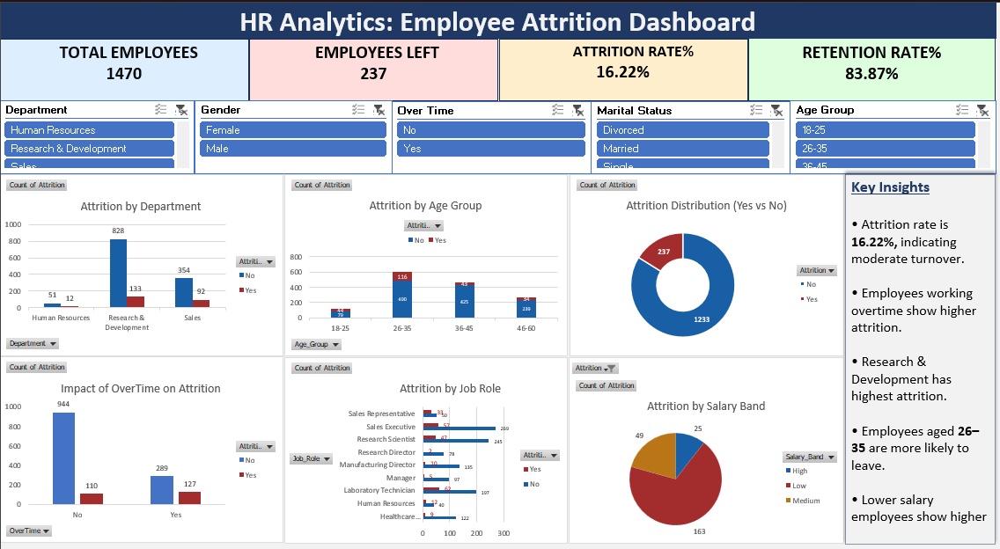

# HR Analytics: Employee Attrition Dashboard

## Project Overview
This project analyzes employee attrition using Excel to identify trends and key factors affecting employee turnover.

## Tools Used
- Microsoft Excel
- Pivot Tables
- Charts & Data Visualization
- Slicers

## Key KPIs
- Total Employees: 1470
- Employees Left: 237
- Attrition Rate: 16.22%
- Retention Rate: 83.87%

## Key Insights
- Attrition rate is 16.22%, indicating moderate turnover.
- Employees working overtime show higher attrition.
- Research & Development has the highest attrition.
- Employees aged 26–35 are more likely to leave.
- Lower salary employees show higher attrition.

## 📷 Dashboard Preview

